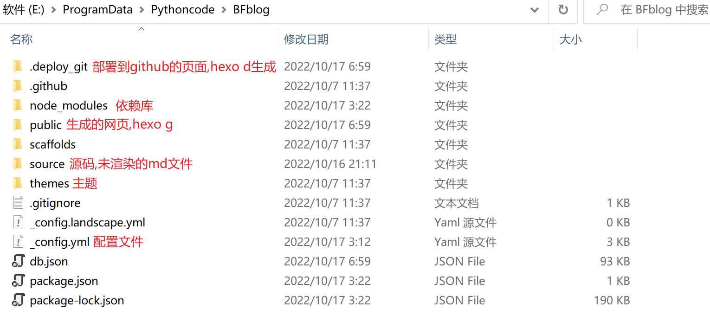

# 常用命令
hexo官网地址：https://hexo.io/zh-cn/docs/ 
1. 初始化【hexo init】
	```cmd
	hexo init [folder]
	```
	- folder为可选参数，为初始化的目录，若无参数指定为当前目录
2. 新建文章【hexo new|hexo n】
	```cmd
	hexo new [layout] <title>
	```
	- title为必填参数，文件名.md，非文章标题，标题在该文件中可以修改
	- layout为可选参数，指定文章类型，包括post、draft、page，无参数则指定为默认类型，默认类型由_config.yml中的default_layout决定，post、draft、page的模板位于scaffolds
	| 参数 | 功能 | 路径 |
	| :--:| :--: | :--: |
	| post | 文章 | /source/_posts/ |
	| draft | 草稿 | /source/_drafts/ |
	| page | 页面/标签/分类等 | /source/ |
3. 清理文件【hexo clean|hexo cl】
    ```cmd
    hexo clean
    ```
    用于清理之前生成的文件
4. 生成静态网页【hexo generate|hexo g】
	```cmd
	hexo generate
	```
	- -d 选项，生成后部署
5. 本地启动【hexo server|hexo s】
	```cmd
	hexo server
	```
	- -p 选项，指定服务器端口号，默认为 4000
	- -i 选项，指定服务器IP地址，默认为 0.0.0.0
	- -s 选项，静态模式，服务器只处理public文件夹内的文件，而不会处理文件变动
	PS:本地服务由hexo-server插件提供。
6. 部署网站【hexo deploy|hexo d】
	```cmd
	hexo server
	```
	将 public 目录中的文件和目录推送至_config.yml中指定的远端仓库和分支中，并且完全覆盖该分支下的已有内容。Hexo会依照顺序执行每个 deployer。
	```yml
	deploy:
	    type: git
	    repo: git@github.com:Bfaner/Bfaner.github.io.git
	    branch: [main]
	    message: [message]
	    type: gitee
	    repo: xxx
	    branch: [main]
	    message: [message]
	```
	branch、message为可选参数，message默认为`Site updated: {{ now('YYYY-MM-DD HH:mm:ss') }}`

# 文件说明
博客里的各文件夹作用如下：

以下是文件的结构，配置文件读取的前后顺序为butterfly→根目录，其中.pug文件是HTML模板引擎，.css是样式表，修改博客的样式主要由配置文件、.pug、.css完成，必要时也需要加入.js函数协助。
```
.
├── _config.yml # 主题配置文件
├── themes # 主题文件夹
│   ├── butterfly # butterfly主题文件
│   │   ├── _config.yml # butterfly主题配置文件
│   │   ├── scripts # 通用js脚本的文件夹
│   │   ├── source # 资源文件夹
│   │   │   ├── css # 样式表保存的文件夹
│   │   │   ├── img # 图片保存的文件夹
│   │   │   └── js # js脚本保存的文件夹
│   │   ├── layout # 布局文件夹
│   │   │   ├── includes # 复用的公共页
│   │   │   ├── archive.pug # 归档页
│   │   │   ├── category.pug # 分类页
│   │   │   ├── index.pug # 主页
│   │   │   ├── page.pug # 页面详情页
│   │   │   ├── post.pug # 文章详情页
├── └── └── └── tag.pug # 标签页
├── scaffolds # 模板文件
│   ├── draft.md # 草稿模板
│   ├── post.md # 文章模板
│   └── page.md # 页面模板
├── public # 生成的页面文件夹(html)
├── source # 资源文件夹
│   ├── _posts # 文章文件夹
│   ├── categories # 分类文件夹
│   ├── tags # 标签文件夹
│   ├── about # 关于文件夹
│   ├── css # CSS
│   │   ├── categoryBar.js # 分类条的js文件
│   └── └── custom.css # 新建的css样式表
└── node_modules # 插件文件夹
```

# 博客样式优化
## 根目录_config.yml
1. 网站标题、子标题
```yml
title: BFaner
subtitle: 'Because we can'
```
2. 网名、个人签名
```yml
description: 'Because we can'
author: 帆小生
language: zh-CN
```
3. 网址链接
文章名通常会带有中文字符，而在网址链接中带有中文字符会比较奇怪。因此使用hexo-abbrlink工具为每篇文章自动生成数字链接，设置'crc16'和'hex'即生成4位16进制的短链接。
```cmd
npm install hexo-abbrlink --save 
```
```yml
url: https://bfaner.github.io/
permalink: posts/:abbrlink.html

abbrlink:
  alg: crc16  #support crc16(default) and crc32
  rep: hex    #support dec(default) and hex
```
4. 主页显示文章数
主页中每页显示的文章数per_page，文章安装日期的反向排序。
```yml
index_generator:
  per_page: 3
  order_by: -date
```
5. 主题
```yml
theme: butterfly
```
6. 部署
见“常用命令”
## theme/_config.yml
### 自定义css及js函数
```yml
inject:
  head:
    - <link rel="stylesheet" href="/css/custom.css" media="defer" onload="this.media='all'">
    - <script async src="/css/categoryBar.js"></script>
```
### 增加分类栏
1. 新建分类栏。在 layout/includes 下新建一个 categorybar.pug。
	```pug
	#category-bar
		.category-bar-items#category-bar-items
			.category-bar-item(id='首页')
				a(href="/") 首页
			.category-bar-item(id='博客相关')
				a(href="/categories/博客相关/") 博客相关
			.category-bar-item(id='编程语言')
				a(href="/categories/编程语言/") 编程语言
			.category-bar-item(id='航空航天')
				a(href="/categories/航空航天/") 航空航天
			.category-bar-item(id='全部分类') 
				a(href="/categories/") 全部分类
		//- a.category-bar-more(id='全部分类',href="/categories/") 全部分类
	```
2. 引用categorybar.pug，使其增加到页面上。在主页index.pug、category.pug、page.pug中分别加入该布局，如category.pug中，在category下增加include includes/categoryBar.pug，注意保持缩进。
	```pug
	extends includes/layout.pug

	block content
	if theme.category_ui == 'index'
		include ./includes/mixins/post-ui.pug
		#recent-posts.recent-posts.category_ui
		+postUI
		include includes/pagination.pug
	else
		include ./includes/mixins/article-sort.pug
		#category
		include includes/categoryBar.pug
		.article-sort-title= _p('page.category') + ' - ' + page.category
		+articleSort(page.posts)
		include includes/pagination.pug
	```
3. 为分类栏增加样式表。在 custom.css 中增加分类栏的样式表。
	```css
	#category a.category-bar-item a{
		color: #000;
		padding: 0.1rem 0.5rem;
		margin: 0 0.25rem;
		font-weight: bold;
		border-radius: 12px;
	}

	.category-bar-item:hover a{
		background:  #65A0D4;
		color: #fff;
	}

	.category-bar-item.select a {
		background:  #65A0D4;
		color: #fff;
		border-radius: 12px;
	}
	```
4. 编写自动选择样式表的函数categoryBar.js。
	```js
	categoriesBarActive()
	//分类条
	function categoriesBarActive(){
	var urlinfo = window.location.pathname;
	urlinfo = decodeURIComponent(urlinfo)
	console.log(urlinfo);
	//判断是否是首页
	if (urlinfo == '/'){
		if (document.querySelector('#category-bar')){
		document.getElementById('首页').classList.add("select")
		}
	}else if(urlinfo == '/categories/'){
		if (document.querySelector('#category-bar')){
		document.getElementById('全部分类').classList.add("select")
		}
	}else {
		// 验证是否是分类链接
		var pattern = /\/categories\/.*?\//;
		var patbool = pattern.test(urlinfo);
		console.log(patbool);
		// 获取当前的分类
		if (patbool) {
		var valuegroup = urlinfo.split("/");
		console.log(valuegroup[2]);
		// 获取当前分类
		var nowCategorie = valuegroup[2];
		if (document.querySelector('#category-bar')){
			document.getElementById(nowCategorie).classList.add("select");
		}
		}
	}
	}
	```