# PID各参数的作用
PID控制器是实际工程中应用最广泛的控制器，其核心思想是“用误差消除误差”，即使用目标值与实际值的差值经过PID控制器得到输入量，去不断修正实际值，使其与目标值接近。以一常规布局固定翼无人机的俯仰角控制系统为例，对PID的各因子进行测试，取其升降舵到俯仰角的传递函数为
$$
\frac {\Delta \theta}{\Delta \delta e}(s)= \frac {-43.023s^3-118.0028s^2-28.7354s}{s^5+5.2253s^4+17.4334s^3+3.724s^2+6.9967s}
$$
## 比例P
通过比例控制器对系统进行控制，系统输入$u=K_P(y_c-y)$。
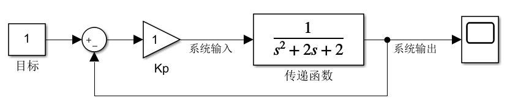
当比例系数$K_P$取0.2、0.5、0.8的响应如下。
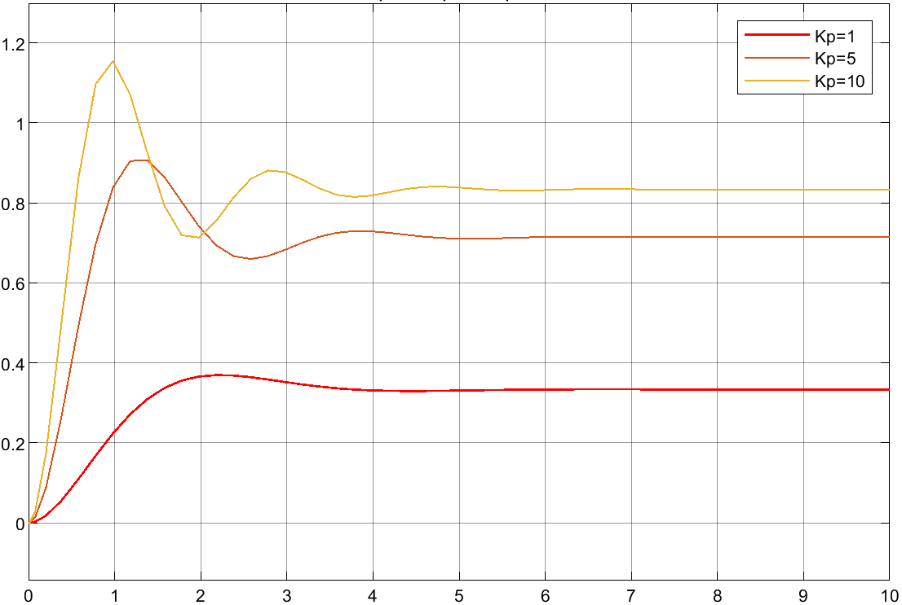
增大$K_P$的优点：
- 操纵输入u增大，加快系统响应。
- 降低系统静差。

$K_P$过大的缺点：
- 系统响应的超调、震荡越大，系统稳定性变差。
- 比例可以减小误差，但是不能完全消除误差。

## 比例P+积分I
通过比例积分控制器对系统进行控制，系统输入$u=K_P(y_c-y)+K_I\int(y_c-y)dt$。
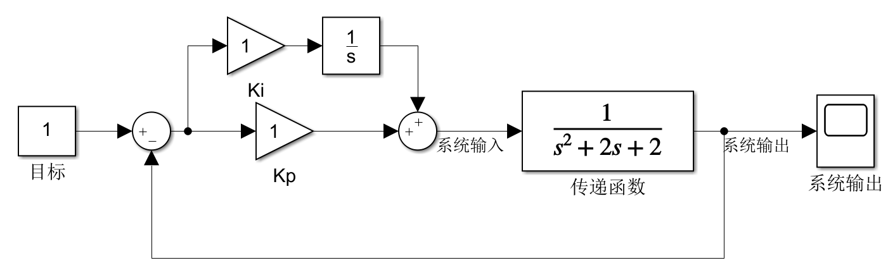
当比例系数取0.5，积分系数$K_I$取0、0.2、0.8的响应如下。
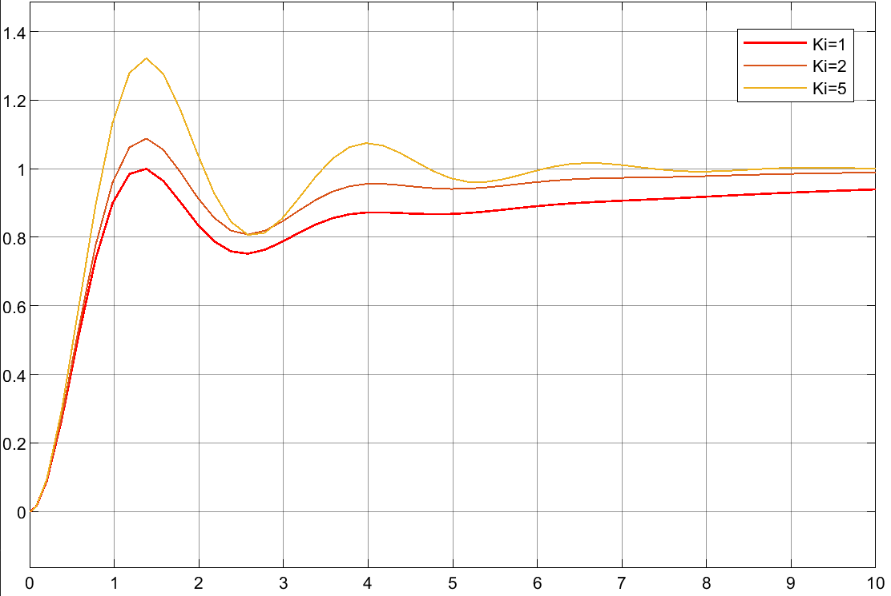
增大$K_I$优点：
- 提升系统响应速度。
- 消除稳态误差。

$K_I$过大缺点：
- 会增大系统超调，降低系统稳定性，甚至使系统震荡。

## 比例P+微分D
通过比例微分控制器对系统进行控制，系统输入$u=K_P(y_c-y)+K_d\frac {de}{dt}$。
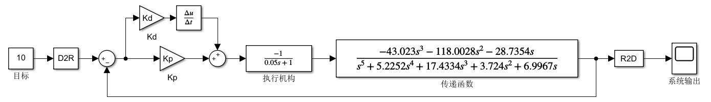
当比例系数取0.5，微分系数$K_I$取0、0.2、0.5的响应如下。
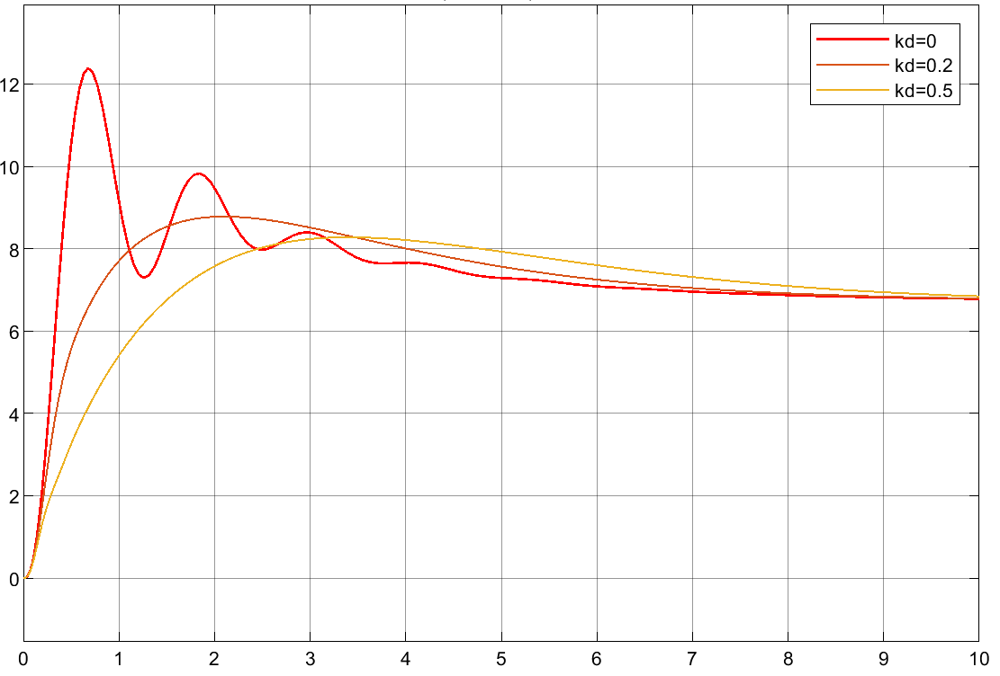
增大$K_d$优点：
- 减小系统超调量，增加系统稳定性。

$K_d$带来的影响：
- 0.5s内，随着时间增加，误差在减小，因此误差的微分小于0，微分项减小了输入量，响应速度减慢。
- 实际应用中，微分作用对噪声干扰有放大作用,过大的微分作用对系统抗干扰不利。

# PID各参数总结
## PID参数作用总结
| 参数 | 比例P | 积分I | 微分D |
| :--: | :--: | :--: | :--: |
| 快速性 | 加快响应速度 | 加快响应速度 | 降低响应速度 |
| 稳定性 | 降低稳定性 | 降低稳定性 | 增加稳定性 |
| 准确性 | 减小稳态误差，但无法消除 | 能消除系统误差 | - |

## 比例P+积分I+微分D
比例、积分、微分同时对系统进行控制，系统输入$u=K_P(y_c-y)+K_I\int(y_c-y)dt+K_d\frac {de}{dt}$。
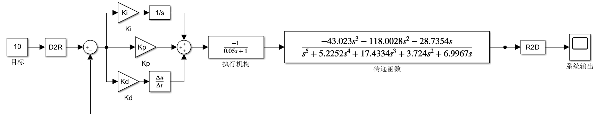
调节流程:
1. 先调比例$K_P$，使得响应最大值接近目标，在附近即可，选择$K_P=0.35$。【*,0,0】
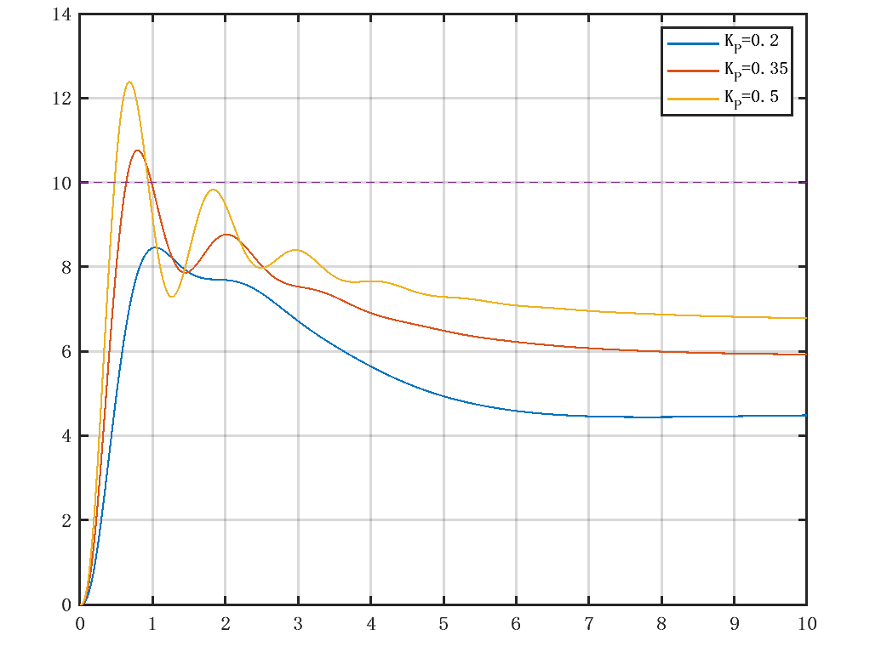
2. 再调节积分$K_I$，使得在合适的时间内稳态误差基本为0，选择$K_I=0.5$。【0.35,*,0】
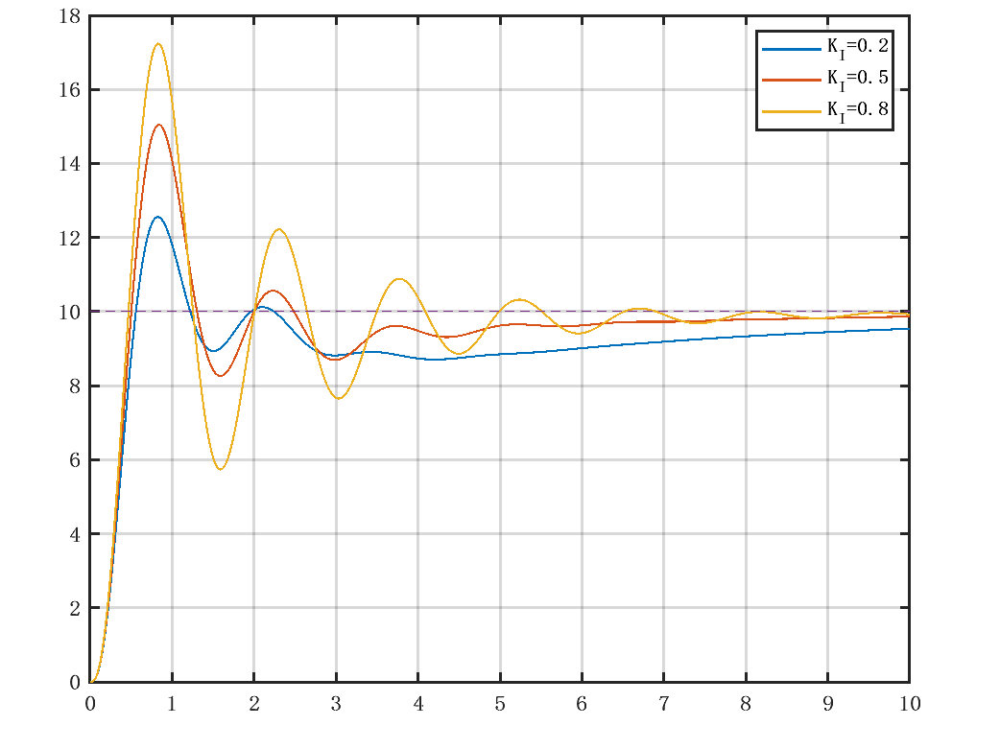
3. 最后调节微分$K_d$，降低系统的超调，选择$K_d=0.1$。【0.35,0.5,*】
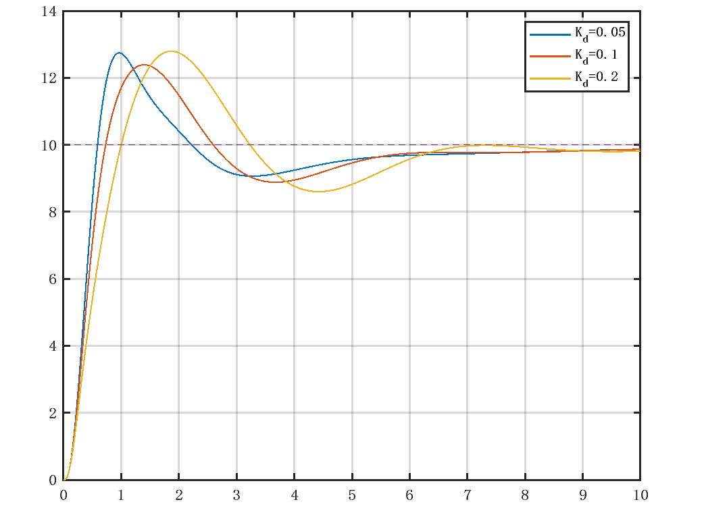
4. 超调还是很大，再次调整$K_P$可以发现，在微分的作用下，比例$K_P$还可以增大，选择$K_P=0.5$。【*,0.5,0.1】
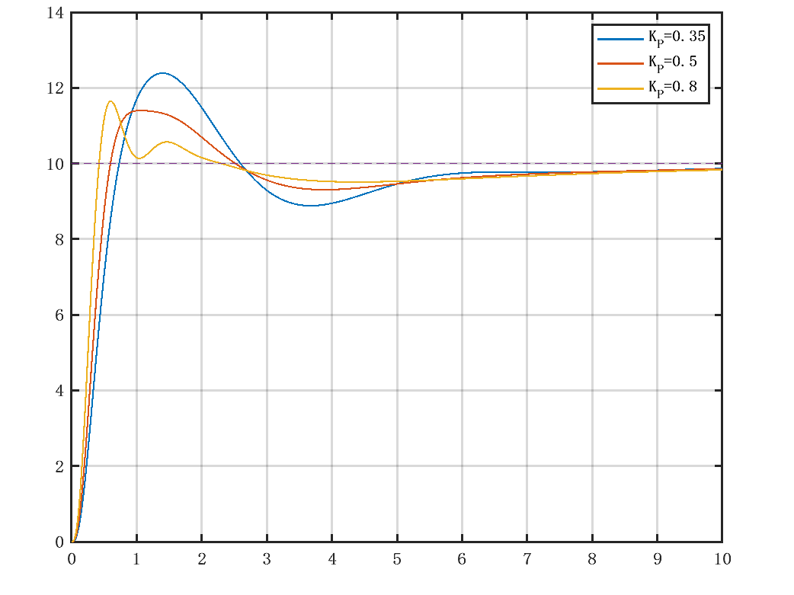
5. 超调还是很大，降低积分$K_I$，在均衡静态误差、超调、响应速度的情况下，选择$K_I=0.3$。【0.5,*,0.1】
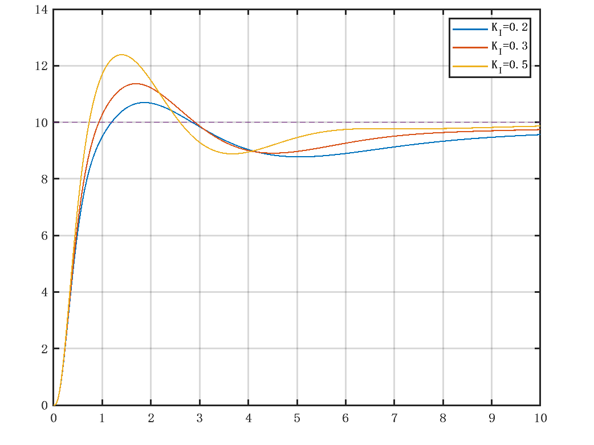
6. 再次调节微分$K_d$，仍选择$K_d=0.1$。【0.5,0.3,*】
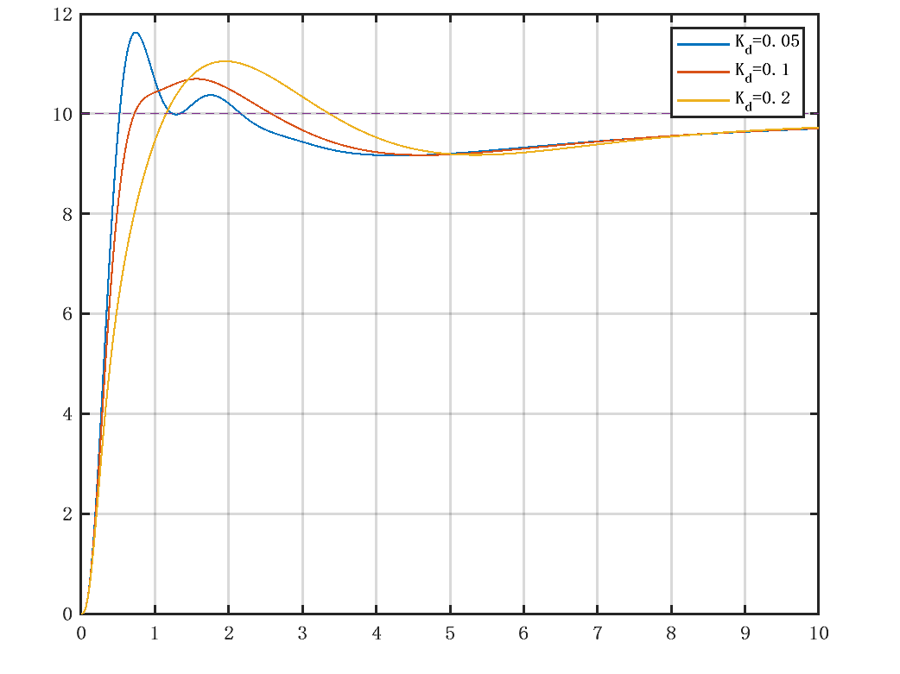
7. 最终效果【$K_P=0.5$,$K_I=0.3$,$K_d=0.1$】
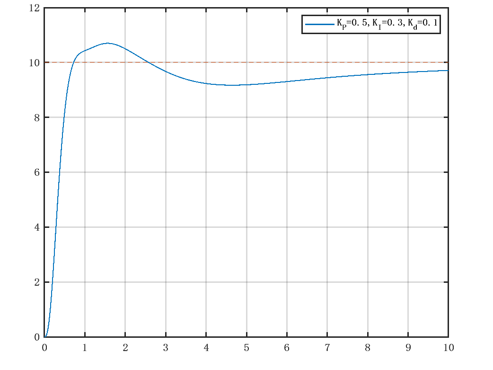

总结：
- 按照“比例-积分-微分”的顺序调参数。
- 一次调不能调整完，需要多个轮次修正。

# 串级PID
## 串级P-PID
在单级PID中，三个参数均进行了使用，但这个调参结果并不是很完美。对于俯仰角控制而言，通常由升降舵作为执行机构，舵面变化会改变俯仰力矩，从而产生姿态角速度，经过时间的累积后姿态发生变化。由舵面转动到俯仰角变化有较大的相位滞后，因此其控制效果常常难以得到保证。在刚刚的系统中观测俯仰角速度q的变化($\theta$的导数)如下：
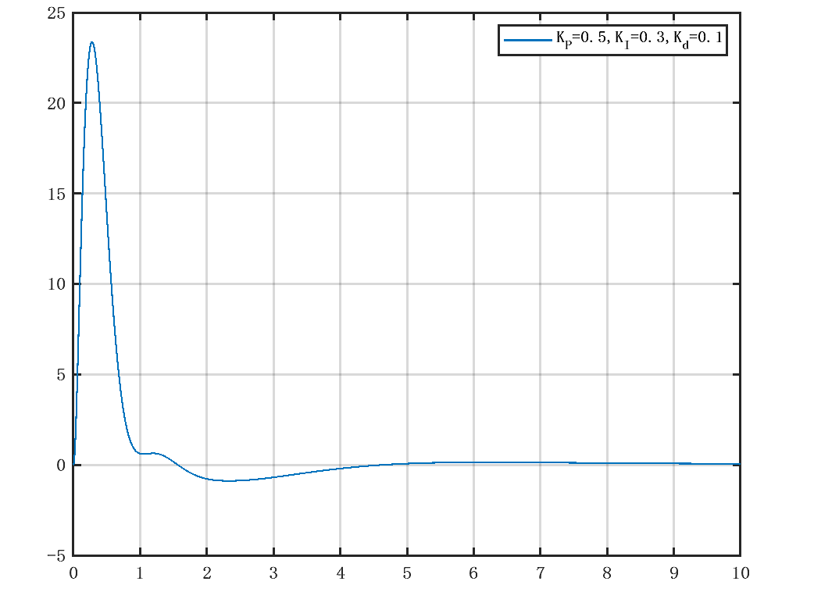
可以看到，俯仰角速度在0附近的上下波动，难以稳定下来，使得造成俯仰角的波动。如果能精确控制俯仰角速度，俯仰角的波动将会得到很好的改善。而飞控由陀螺仪可以得到实时的俯仰角速度，具备可观可控性。

使用串级PID的条件：
- 内环参数可观测(如本例的俯仰角速度)

外环：
- 姿态角误差经过P得到角速度目标。
- 俯仰角速度到俯仰角的传递函数简单(积分)，仅使用比例即可。

内环：
- 要求静差：使用PI【固定翼无人机姿态角对性能的影响较大，使用积分可以保证姿态角】。
- 要求稳定性：使用PD【旋翼无人机由电机操纵，电机的惯性环节大，由微分可以提高稳定性】。

## P-PI
对上述固定翼无人机，其升降舵到俯仰角速度的传递函数为：
$$
\frac {\Delta q}{\Delta \delta e}(s)= \frac {-43.023s^3-118.0028s^2-28.7354s}{s^4+5.2253s^3+17.4334s^2+3.724s+6.9967}
$$
搭建其P-PI串级控制系统如下：
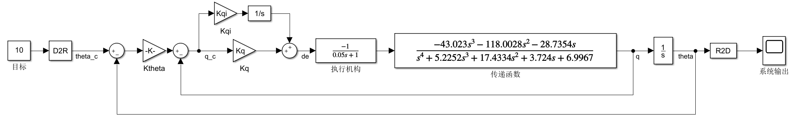
其控制律为：
$$
q_{sp}=K_θ (θ_{sp}-θ)
$$
$$
δ_e=k_q (q_{sp}-q)+k_{qi} \int(q_{sp}-q) dt
$$

调参流程：
观察俯仰角速度的传递函数发现，其稳态值为0/6.9967=0，也就是经过一段时间后q必定为0。因此不能实现先控内环再控外环(旋翼的速度控制是可以的)。因此参数也只能是三个参数一起调整。
1. 首先根据经验取一组参数，对于固定翼的俯仰控制，通常先取$K_\theta=2, K_q=0.2, K_{qi}=0.1$，仿真得到其结果如下：
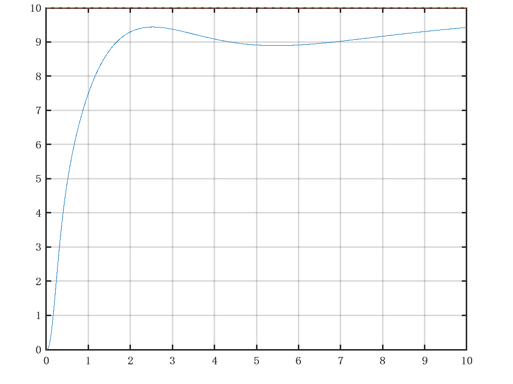
2. 调整$K_\theta$，不要让其出现抖动，选择$K_\theta=4$【*,0.2,0.1】
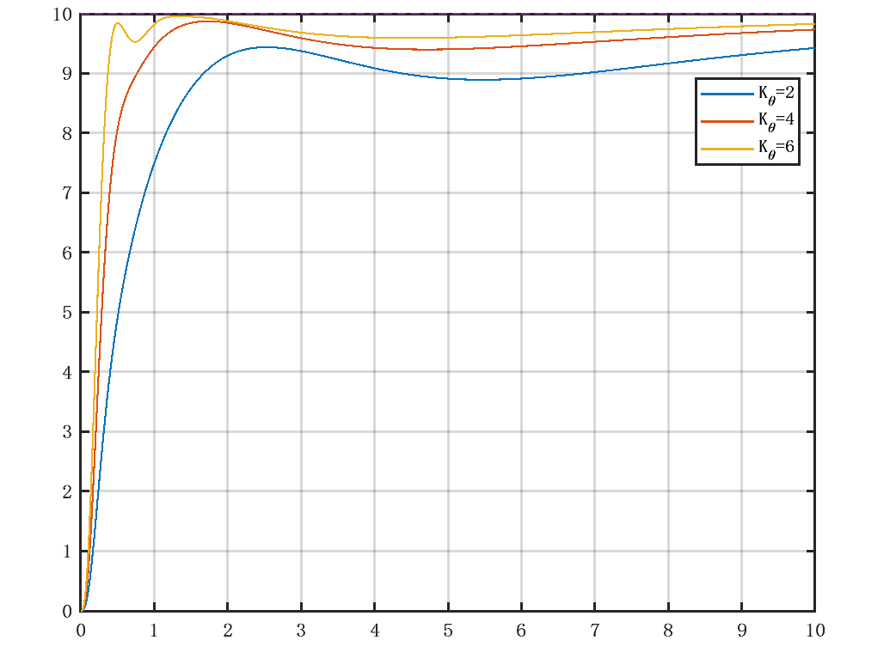
3. 调整$K_q$，选择较小的参数，并保证无超调，选择$K_q=0.2$【4,*,0.1】
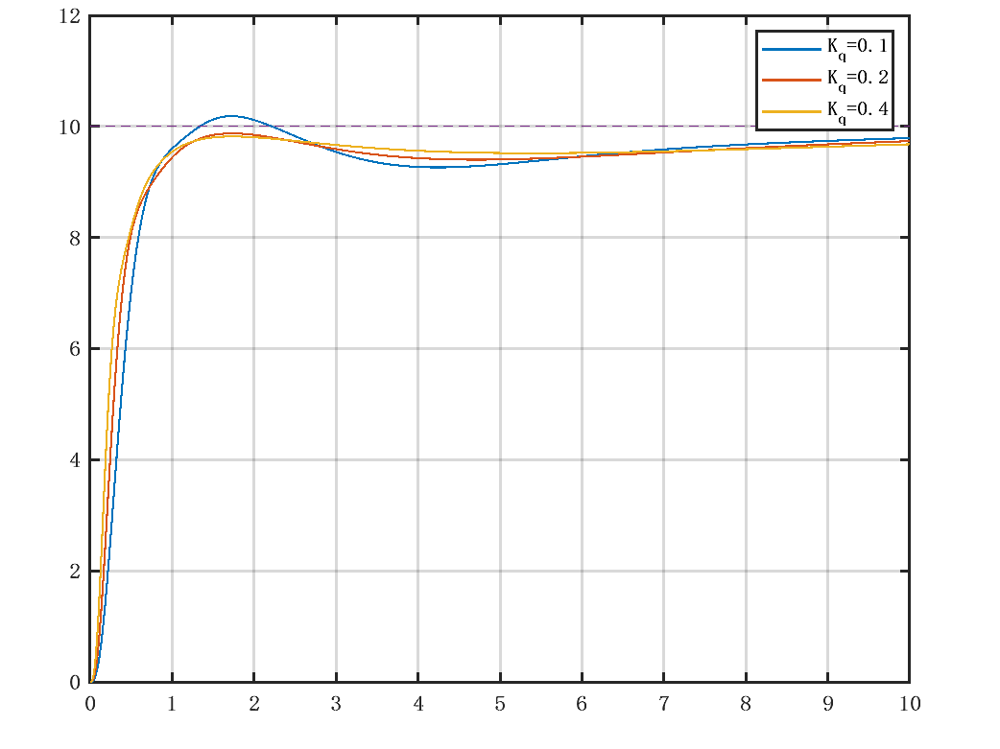
4. 调整$K_{qi}$，减小稳态误差，但不要让其出现抖动，选择$K_{qi}=0.2$【4,0.2,*】
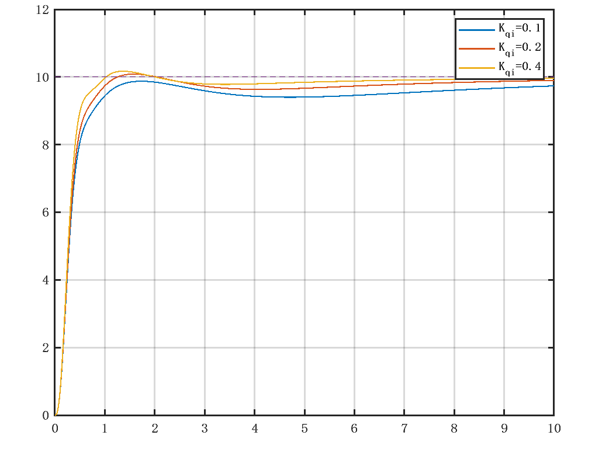

注意：
- 效果差别不大的情况，尽量选较小的参数。
- 实验时发现抖动，立即减小内环的$K_q$，一般情况下飞机抖动会下降。
- 操纵手提示操纵过于灵敏，减小$K_\theta $；操纵手提示操纵过于迟缓，增大$K_\theta $，若效果不明显，则增大$K_q$，但不能让飞机出现抖动。
- 飞机操纵效果、抖动都不存在问题时，如果稳态误差较大，再调整$K_{qi}$。
- 上述仿真仅针对了俯仰角的传递函数，俯仰角最终的效果并不是很完美。这是由于纵向是俯仰角与速度的耦合，仅对俯仰角仿真，而不考虑速度，效果会有一定下降。对于纵向四阶状态空间的仿真，可以先将速度的控制增益增大，保证速度基本不变，再调整俯仰角，最终的曲线便可非常光滑。二者调参的过程基本一致，此处使用传递函数方便理解。

## P-PD
取一个典型四旋翼无人机Minifly，其传递函数如下：

## PX4参数
在飞控中，固定翼的控制律结构如下：
$$
q_{sp}=(\theta _{sp}−\theta )/t_c
$$

$$
\delta e=q_{sp}∗k_{ff}∗scaler+[(q_{sp}−q)∗k_q+\int (q_{sp}-q) dt]∗scaler^2
$$

$$
scaler= \frac {airspeed_{trim}}{airspeed}
$$
上述参数对应地面站显示为
| 参数 | 外环比例P | 内环比例P | 内环积分I |
| :--: | :--: | :--: | :--: |
| 控制律 | $\frac {1}{K_θ}$ | $K_q$ | $K_{qi}$ |
| PX4 | $t_c$ | $K_q$ | $K_{qi}$ |
| QGC | FW_P_TC | FW_PR_P | FW_PR_I |

地面站截图：
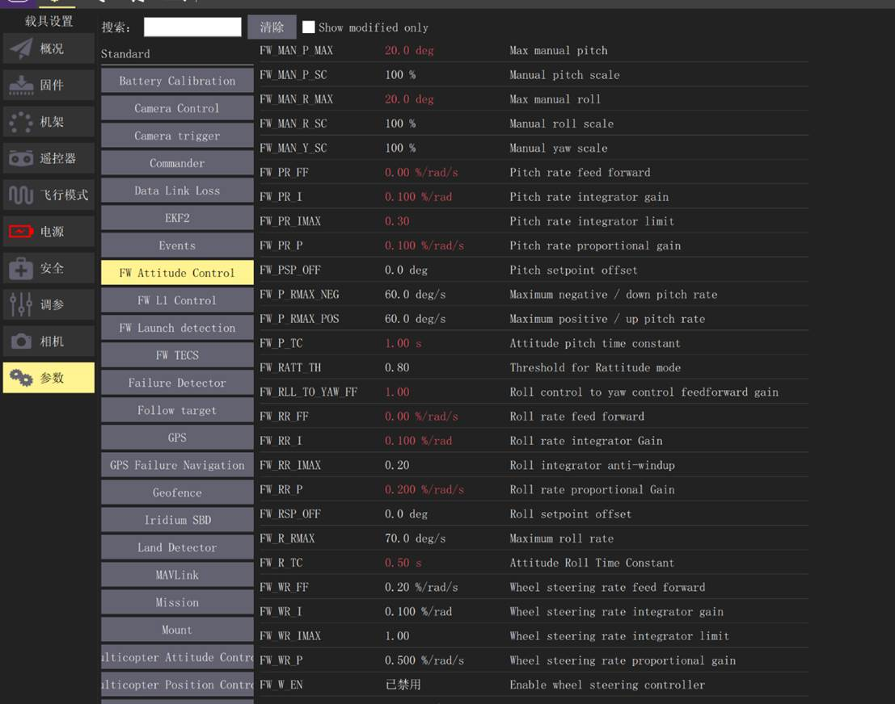
# 总结
## 为什么用串级PID
- 单级PID控制效果不好
- 内环参数可观测
## 调参方法
- 单级PID:
按照“比例-积分-微分”的顺序调参数，多次迭代优化。
- 串级PID

